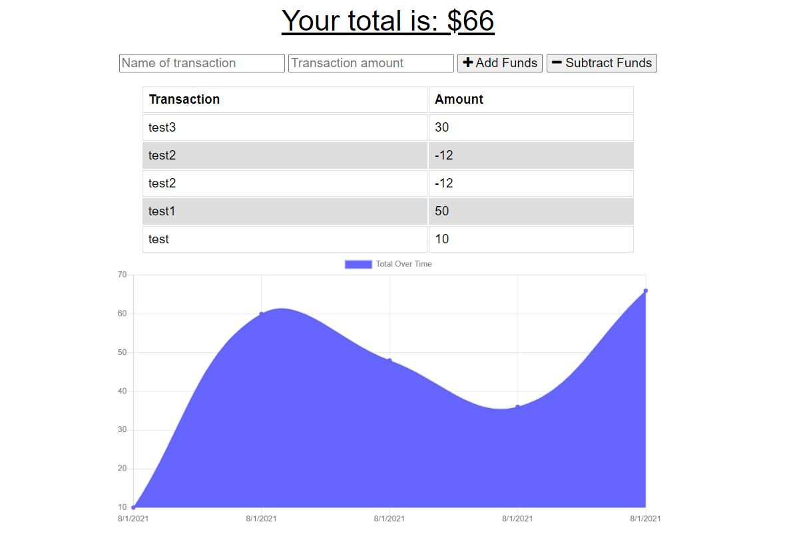

# PWA-Budget-Tracker

## Purpose

This application gives users a fast and easy way to track their money Most importantly, it has offline functionality. The user is able to add expenses and deposits to their budget with or without a connection. If the user enters transactions offline, the total should be updated when they're brought back online.

## Built With

- JavaScript
- Node.js
- Express.js
- IndexedDb
- Manifest.json
- service-worker.js

## Website

## Contribution

Made by Archita
